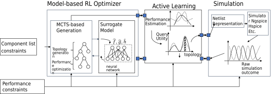

# RL-AL-for-Power-Converter-Design

## Table of Contents

- [Description](#Description)
- [Environment](#environment)
- [Representation](#representation)
- [Framework](#framework)
- [File Structure](#file-structure)
- [Surrogate Model: Setting](#setting)
- [Surrogate Model: Training](#Model-Training)
- [RL-based Converter Design: Setting](#RL-based Converter Design-Setting)
- [RL-based Converter Design: Generation](#RL-based Converter Design-Generation)
- [Result](#result)


## Description
This is the program of the project: "Model-based Reinforcement Learning with Active Learning for Efficient Electrical Power Converter Design".

## Environment

Operating system: Linux  
Python: Python3.6, Python 3.7 or Python 3.8  
Package: ngspice, matplotlib tqdm numpy scipy wandb networkx lacpy gpytorch transformers and pytorch
```sh
$ sudo apt install ngspice
$ pip3 install matplotlib tqdm numpy scipy wandb networkx lacpy gpytorch transformers
```
To install pytorch:
```sh
Check the cuda version: nvidia-smi, right top corner: mostly CUDA Version: 11.x
Go to https://pytorch.org/ , choose 'stable', 'linux' 'pip' python and 'cuda version'. Then copy the generate command and run with the terminal
```
To login wandb: run
```sh
python3 -m wandb login
```
, then copy the API key from the wandb website-> setting of your accont and paste in the terminal.


## Representation
The representation of the circuit topology is in 
[Circuit Topology Representation](https://docs.google.com/document/d/11uZc5bnAYsA0y2QXCEg8ZDCuWyo-lImWUmJ4b-MA2cA/edit?usp=sharing).


[//]: # (**max_episode_length**: The max allowed step for simulator to take action  )


## Framework

our Model-based Reinforcement Learning with Active Learning framework for Efficient Electrical Power Converter Design 
consists of three components: a Transformer-based surrogate model, a RL algorithm for converter generation, and an
active learning strategy. Compared with high-fidelity simulation, the Transformer-based surrogate model predicts circuit
performance more efficiently and with high accuracy. The RL algorithm is a Monte-Carlo tree-search method to efficiently
generate the converter topology and select the duty cycle to optimize the performance of the converter circuit step by 
step. We uses the reward signal provided by the surrogate model to explore the topology space efficiently for 
high-quality circuits. The active learning strategy selectively queries high-fidelity simulation to improve the accuracy
of the surrogate model during the exploration and hence improve the quality of the output circuit.
<div style="text-align: center;">

</div>

Please refer the Technical Report for the framework details.

## File Structure:
We provide a list of files and folders and that is important for usage.

**al_arguments.py**: The main configurations for running time whole framework.  
**config.py**: specify the name of the task and fixing the number of components or not.   
**GNN_gendata**: sub-project to generate the training data.  
**Low_Frequency_Files**: some cached codes with low-frequency usage.   
**plotUtils.py**: tool functions for plotting results.  
**PM_GNN**: cached old GNN program.  
**topo_data_util**: tool functions for model training.  
**topo_envs**: tool functions for applying the surrogate model in the framework.  
**topoQueryExp.py**: the main function to generate the converter circuit.  
**topoUtils.py**:tool functions for topology generation.  
**transformer_SVGP**: the folder of surrogate model.  
**queryUpdate.py**: functions of active learning.  
**UCT_5_UCB_unblc_restruct_DP_v1**: the folder of RL-based surrogate model.  
**uctHelper.py**:tool functions for topology generation.


## Surrogate Model: Setting
The settings are configured in the file **transformer_SVGP/transformer_args.py** 

**data**: the name of the dataset json file  
**train_ratio**: proportion of data used for training. The type is float. It is set as 0.6 as default.  
**dev_ratio**: proportion of data used for validation. The type is float. It is set as 0.2 as default.  
**test_ratio**: Float type proportion of data used for testing. It is set as 1-training_ratio-dev_ratio.  
**save_model**: save the trained model to this file if provided. The value is the model file name.  
**encoding**: the path encoding method.  
**duty_encoding**: the string type duty cycle encoding method. We input the duty cycle one of
the input of the multi-layer perceptron if set as ”mlp”. Otherwise, if set as ”path”, we encode
the duty cycle into the path embedding.  
**epoch**: number of epoch for model training.  
**batch_size**: the size of the batch.  
**d_model**: integer type of the dimension of the path embedding if using single direction
LSTM, otherwise the dimension is double of d model.  
**n_heads**: the integer type of the number of the head of the multi-head attention network.  
**n_layers**: the integer type of the number of the layers of the transformer network.  
**mlp_layers**:the integer type of the layer number of the multi-layer perceptron after the transformer.  
**plot_outliers**: true for plot the cases where ground truth and surrogate model disagree.  
**max seq len**: the integer type of the maximum number of devices in a path.  
**attribute len**: the integer type of the maximum number of path in a circuit topology.  
**pretrained model**: true for using the pretrained and continuing training a model.  
**patience**: integer type of the number of patience for early stop.  
**seed**: integer type of the randomness seed.  
**target**: the string type of the target prediction to train the model.  

### Surrogate Model: Training

To train the surrogate model, usually we need to specify the dataset file, target, encoding method, random seed, 
training ratio and saving model file name. We use add the seed as the suffix to differentiate the models.
For example, if we what to train a model using 60% the 5-component circuit data in the "dataset_5_cleaned_label.json" to 
predict the efficiency with the random seed 1 and lstm encoding. We can execute the following command in the folder
**transformer_SVGP**:
```sh
python auto_train.py -data dataset_5_cleaned_label.json -target eff -encoding lstm -seed $i -train_ratio 0.6 -save_model lstm_model/5_all_lstm_eff_1.pt
```
To train different models with multiple seeds, please use the run_5_eff_exp.sh and run_5_eff_vout.sh.

### RL-based Converter Design: Setting
The settings are configured in the file **al_arguments.py**:

**seed-range**: The range of the random seeds for evaluation    
**k-list**: A list of  k for top-k evaluation.  
**prop-top-ratios**: A list of proportion to get top-k.  
**base_trajs**: A set of basic trajectories for multi-iteration circuit generation. The number of trajectory is a number 
of base_trajs.      
**traj-list**: The list of trajectories for multiple iteration of generation. In each iteration, we use RL to gernerate 
a set of circuits and use AL to update the model. We support different trajectories for different iterations.  
**eff-model-seed**:  Random seed for the efficiency surrogate model.  
**vout-model-seed**:  Random seed for the output voltage surrogate model.  
**eff-model-seeds**:  Random seeds for the efficiency model.This is used to evaluate different surrogate models.  
**vout-model-seeds**:  Random seeds for the output voltage model.This is used to evaluate different surrogate models.  
**training-data-file**: The name of the dataset for surrogate model training.  
**model**: The name of the model for circuit evaluation.   
**update-rewards**: Set as true if we use the simulation reward to replace the surrogate model rewards after AL.
**AL-strategy**: The active learning strategy to use. Defaultly we use hybrid method.  
**save-realR**: Set true if save the simulation rewards for evalution.  
**cumulate-candidates**: Set true if using all the simulation results in the top-k strategy.      
**update-gp**:Set true if updating the surrogate model after AL.  
**reuse-tree-after-al**:  Set true if reusing the tree generated in the previous iterations after AL.  
**recompute-tree-rewards**: Set true if updating the rewards on the MCTS tree after AL.     
**sample-ratio**:  Random sampling ratio from old dataset in AL.  
**retrain-query-ratio**:  Sampling ratio from candidate states for AL.  
**component-default-policy**:  Set true if using the default policy when selecting components.  
**path-default-policy**:  Set true if using the default policy when connect the components.  
**sweep**:Set true if sweep the duty cycle when evaluate a circuit.

The target ouput voltage is set in the UCT_5_UCB_unblc_restruct_DP_v1/config.py/target_vout. We set it as 50 as default. 
### RL-based Converter Design: Generation

To run the whole framework, please set the configurations in the **al_arguments.py** and directly run:
```sh
python topoQueryExp.py
```

## Result
The result for different random seeds are stored in the a file with the following order of information.
```sh
seed, number of query, output converter reward, total running time, number of trajectories, total AL time, 
number of queries to get the reward, number of newly observed circuits, number of newly observed topologies, 
number of queries in AL, number of epoch to update efficiency model in AL, 
number of epoch to update output voltage model in AL
```
The file is in the folder: Merged_Results, and named with the date, process pid and the top-k.

